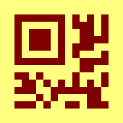

qrcode-rust
===========

[](https://travis-ci.org/kennytm/qrcode-rust)
[](https://coveralls.io/github/kennytm/qrcode-rust?branch=coveralls)
[](https://crates.io/crates/qrcode)
[](./LICENSE-APACHE.txt)

QR code and Micro QR code encoder in Rust. [Documentation](https://docs.rs/qrcode).

Cargo.toml
----------

```toml
[dependencies]
qrcode = "0.11"
```

The default settings will depend on the `image` crate. If you don't need image generation capability, disable the `default-features`:

```toml
[dependencies]
qrcode = { version = "0.11", default-features = false }
```

Example
-------

## Image generation

```rust
use qrcode::QrCode;
use image::Luma;

fn main() {
    // Encode some data into bits.
    let code = QrCode::new(b"01234567").unwrap();

    // Render the bits into an image.
    let image = code.render::<Luma<u8>>().build();

    // Save the image.
    image.save("/tmp/qrcode.png").unwrap();
}
```

Generates this image:


## String generation

```rust
use qrcode::QrCode;

fn main() {
    let code = QrCode::new(b"Hello").unwrap();
    let string = code.render::<char>()
        .quiet_zone(false)
        .module_dimensions(2, 1)
        .build();
    println!("{}", string);
}
```

Generates this output:

```none
##############    ########  ##############
##          ##          ##  ##          ##
##  ######  ##  ##  ##  ##  ##  ######  ##
##  ######  ##  ##  ##      ##  ######  ##
##  ######  ##  ####    ##  ##  ######  ##
##          ##  ####  ##    ##          ##
##############  ##  ##  ##  ##############
                ##  ##
##  ##########    ##  ##    ##########
      ##        ##    ########    ####  ##
    ##########    ####  ##  ####  ######
    ##    ##  ####  ##########    ####
  ######    ##########  ##    ##        ##
                ##      ##    ##  ##
##############    ##  ##  ##    ##  ####
##          ##  ##  ##        ##########
##  ######  ##  ##    ##  ##    ##    ##
##  ######  ##  ####  ##########  ##
##  ######  ##  ####    ##  ####    ##
##          ##    ##  ########  ######
##############  ####    ##      ##    ##
```

## SVG generation

```rust
use qrcode::{QrCode, Version, EcLevel};
use qrcode::render::svg;

fn main() {
    let code = QrCode::with_version(b"01234567", Version::Micro(2), EcLevel::L).unwrap();
    let image = code.render()
        .min_dimensions(200, 200)
        .dark_color(svg::Color("#800000"))
        .light_color(svg::Color("#ffff80"))
        .build();
    println!("{}", image);
}
```

Generates this SVG:

[](src/test_annex_i_micro_qr_as_svg.svg)

## Unicode string generation

```rust
use qrcode::QrCode;
use qrcode::render::utf8;

fn main() {
    let code = QrCode::new("mow mow").unwrap();
    let image = code.render::<utf8::Unicode1x2>()
        .dark_color(utf8::Unicode1x2::Light)
        .light_color(utf8::Unicode1x2::Dark)
        .build();
    println!("{}", image);
}
```

Generates this output:

```
█████████████████████████████
█████████████████████████████
████ ▄▄▄▄▄ █ ▀▀▀▄█ ▄▄▄▄▄ ████
████ █   █ █▀ ▀ ▀█ █   █ ████
████ █▄▄▄█ ██▄  ▀█ █▄▄▄█ ████
████▄▄▄▄▄▄▄█ ▀▄▀ █▄▄▄▄▄▄▄████
████▄▀ ▄▀ ▄ █▄█  ▀ ▀█ █▄ ████
████▄██▄▄▀▄▄▀█▄ ██▀▀█▀▄▄▄████
█████▄▄▄█▄▄█  ▀▀▄█▀▀▀▄█▄▄████
████ ▄▄▄▄▄ █   ▄▄██▄ ▄ ▀▀████
████ █   █ █▀▄▄▀▄▄ ▄▄▄▄ ▄████
████ █▄▄▄█ █▄  █▄▀▄▀██▄█▀████
████▄▄▄▄▄▄▄█▄████▄█▄██▄██████
█████████████████████████████
▀▀▀▀▀▀▀▀▀▀▀▀▀▀▀▀▀▀▀▀▀▀▀▀▀▀▀▀▀
```